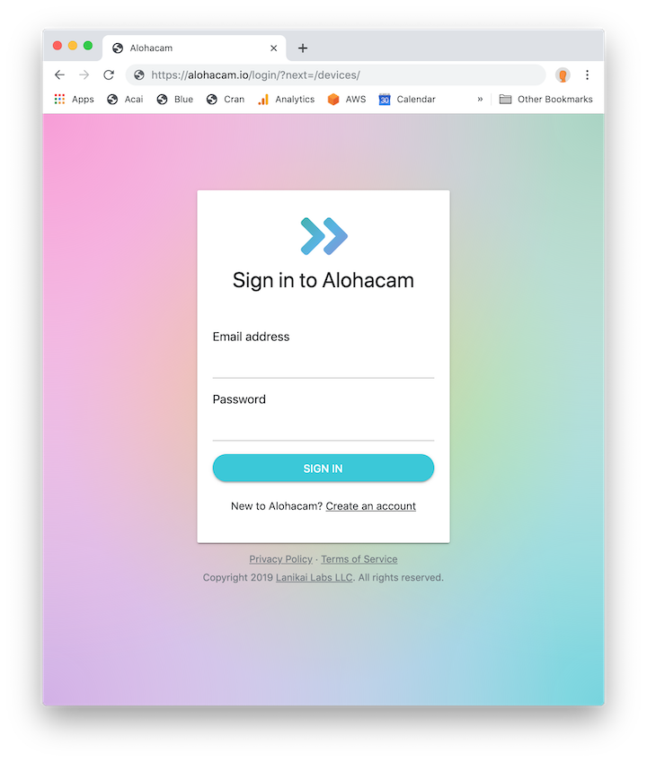
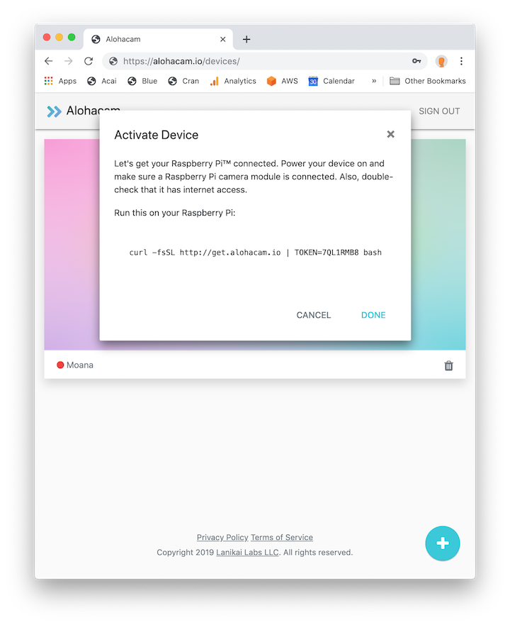

# A beginner's guide to Alohacam:

If you haven't already, request a Beta invite [here](https://lanikailabs.com/alohacam). Once you receive your invite email, click the unique link provided to register and log into your account. 

You're now ready to add your first device! First, make sure your Raspberry Pi is powered on and connected to the Internet.   
 
The main Alohacam webpage should now be displaying the "Add your first device" modal. Choose a name for your Alohacam (like "Moana") and click Add.

 
The modal will now display a command with a unique token. Copy this entire command, and run it on your Raspberry Pi in `$HOME`.

Your Raspberry Pi will now download and configure the Alohacam executable. This may take a few minutes, so be patient :)
      – If you are prompted to reboot your Raspberry Pi during this process, choose Yes. 
      – Once your Raspberry Pi reboots and reconnects to the Internet, run the command `./alohacam` to start Alohacam. 
    
After you have successfully run the executable on your Raspberry Pi, click Done. You will now be brought back to the dashboard, where you can see your Alohacam. 

You can now view your device's live video stream! You'll also find the controls to pause and play the video, enter full screen mode, or delete the device.
  
  
Keep in mind that if you unplug or power down your Raspberry Pi, you'll need to re-run the `./alohacam` command upon boot to restart Alohacam. 

If you run into any issues or still have questions, reach out to us at aloha@lanikailabs.com! 
